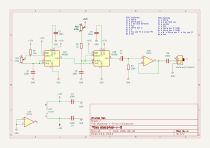
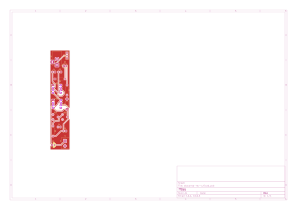

# ataconso

## Revisiones

- `rev-a`: experimento, no ha sido fabricado.
- `rev-b`: fabricado entre agosto y septiembre 2026, funcionó.
- `rev-c`: revisión activa (en desarrollo). Es la que se documenta abajo.

## Esquemático y placa (rev-c)

Generados automáticamente por GitHub Actions a partir de `ataconso/ataconso-v-0-rev-c/ataconso-v-0-rev-c.kicad_sch` y `.kicad_pcb` en cada push que los modifica.

## Bill of materials (rev-c)

Generado a partir de `ataconso/ataconso-v-0-rev-c/ataconso-v-0-rev-c.kicad_sch`.

<!-- BOM_TABLE_START -->
| Referencias | Cantidad | Valor | Huella | Descripción |
| --- | --- | --- | --- | --- |
| C1, C2, C3, C4, C5, C6, C8 | 7 | 100n | *(sin huella asignada)* | Capacitor cerámico |
| C7 | 1 | 1u | *(sin huella asignada)* | Capacitor electrolítico |
| D1, D2 | 2 | D_Schottky | easyeda2kicad:SOD-123FL_L2.8-W1.8-LS3.7-R-RD | Diodo Schottky |
| J1 | 1 | AudioJack2_SwitchT | ataconso-v-0-rev-c:Jack_3.5mm_QingPu_WQP-PJ398SM_Vertical | Jack de audio 3.5mm |
| J2 | 1 | Conn_02x05_Odd_Even | BYOM_General:IDC-Header_2x05_P2.54mm_Vertical | Header de alimentación Eurorack (10 pines) |
| R1 | 1 | 10k | *(sin huella asignada)* | Resistencia |
| R2 | 1 | 1k | *(sin huella asignada)* | Resistencia |
| R3 | 1 | 100k | *(sin huella asignada)* | Resistencia |
| RV1, RV2 | 2 | 470k | ataconso-v-0-rev-c:POT_TH_Alps_RK09K_Single_Vertical | Potenciómetro |
| U1 | 1 | TL072 | *(sin huella asignada)* | Amplificador operacional dual |
| U2 | 1 | NA556 | Package_SO:SOIC-14W_7.5x9mm_P1.27mm | Temporizador doble 556 |

19 componentes en total. Los ítems marcados *(sin huella asignada)* todavía no están completos en el esquemático — hay que completarlos antes de generar gerbers o comprar partes para esta revisión.
<!-- BOM_TABLE_END -->
