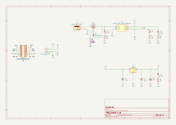
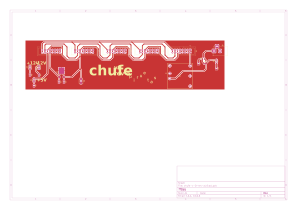

# chufe

Bus de alimentación eurorack.

## Revisiones

- `v-0-rev-a`: en progreso, septiembre 2026.

## Esquemático y placa (v-0-rev-a)

Generados automáticamente por GitHub Actions a partir de `chufe/chufe-v-0-rev-a/chufe-v-0-rev-a.kicad_sch` y `.kicad_pcb` en cada push que los modifica.

## Bill of materials (v-0-rev-a)

Generado a partir de `chufe/chufe-v-0-rev-a/chufe-v-0-rev-a.kicad_sch`.

<!-- BOM_TABLE_START -->
| Referencias | Cantidad | Valor | Huella | Descripción |
| --- | --- | --- | --- | --- |
| C1, C2 | 2 | 100n | Capacitor_SMD:C_0805_2012Metric | Capacitor cerámico |
| C3 | 1 | 22u | Capacitor_SMD:CP_Elec_4x5.4 | Capacitor electrolítico |
| D1, D2, D3, D4 | 4 | LED | LED_THT:LED_D3.0mm | Device:LED |
| J1, J2, J3, J4, J5 | 5 | Conn_02x08_Odd_Even | Connector_IDC:IDC-Header_2x08_P2.54mm_Vertical | Connector_Generic:Conn_02x08_Odd_Even |
| J6 | 1 | Barrel_Jack_Switch | Connector_BarrelJack:BarrelJack_Horizontal | Connector:Barrel_Jack_Switch |
| Q1 | 1 | AO3401A | Package_TO_SOT_SMD:SOT-23 | Transistor_FET:Q_PMOS_GSD |
| R1, R6 | 2 | 2k2 | Resistor_SMD:R_0805_2012Metric | Resistencia |
| R2 | 1 | 1k | Resistor_SMD:R_0805_2012Metric | Resistencia |
| R3, R4, R5 | 3 | 10k | Resistor_SMD:R_0805_2012Metric | Resistencia |
| U1 | 1 | URA2412YMD-20WR3_C5369773 | easyeda2kicad:PWRM-TH_YLPTEC_VRBXXXXYMD-20WR3 | easyeda2kicad:URA2412YMD-20WR3_C5369773 |
| U2 | 1 | L7805 | Package_TO_SOT_SMD:TO-252-2 | Regulador de voltaje lineal +5V |

22 componentes en total.
<!-- BOM_TABLE_END -->
