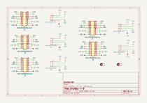
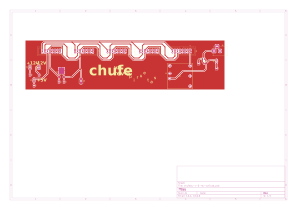

# chufebu

Bus de alimentación eurorack: 5 headers de 16 pines (2x08) con ±12V y +5V, cada uno con su conector Molex KK-396 de 4 pines.

## Revisiones

- `v-0-rev-a`: en progreso, octubre 2026.

## Esquemático y placa (v-0-rev-a)

Generados automáticamente por GitHub Actions a partir de `chufebu/chufebu-v-0-rev-a/chufebu-v-0-rev-a.kicad_sch` y `.kicad_pcb` en cada push que los modifica.

## Bill of materials (v-0-rev-a)

Generado a partir de `chufebu/chufebu-v-0-rev-a/chufebu-v-0-rev-a.kicad_sch`.

<!-- BOM_TABLE_START -->

| Referencias | Cantidad | Valor | Huella | Descripción |
| --- | --- | --- | --- | --- |
| J1, J2, J3, J7, J8 | 5 | Conn_02x08_Odd_Even | Connector_IDC:IDC-Header_2x08_P2.54mm_Vertical | Header 2x08 |
| J4, J5, J6, J9, J10 | 5 | Conn_01x04_Pin | Connector_Molex:Molex_KK-396_5273-04A_1x04_P3.96mm_Vertical | Conector macho 1x04 |

10 componentes en total.

<!-- BOM_TABLE_END -->
