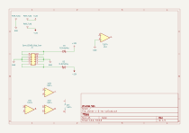
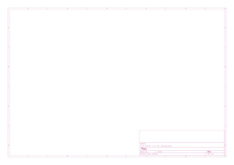

# diente

## Revisiones

- `v-0-rev-a`: en progreso, septiembre 2026.

## Esquemático y placa (v-0-rev-a)

Generados automáticamente por GitHub Actions a partir de `diente/diente-v-0-rev-a/diente-v-0-rev-a.kicad_sch` y `.kicad_pcb` en cada push que los modifica.

## Bill of materials (v-0-rev-a)

Generado a partir de `diente/diente-v-0-rev-a/diente-v-0-rev-a.kicad_sch`.

<!-- BOM_TABLE_START -->
| Referencias | Cantidad | Valor | Huella | Descripción |
| --- | --- | --- | --- | --- |
| D1, D2 | 2 | D_Schottky | easyeda2kicad:SOD-123FL_L2.8-W1.8-LS3.7-R-RD | Diodo Schottky |
| J1 | 1 | Conn_02x05_Odd_Even | BYOM_General:IDC-Header_2x05_P2.54mm_Vertical | Header de alimentación Eurorack (10 pines) |

3 componentes en total.
<!-- BOM_TABLE_END -->
