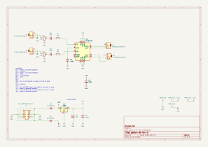
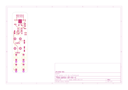

# parla

## Revisiones

- `v-0-rev-c`: única revisión presente en el repositorio.

## Esquemático y placa (v-0-rev-c)

Generados automáticamente por GitHub Actions a partir de `parla/parla-v-0-rev-c/parla-v-0-rev-c.kicad_sch` y `.kicad_pcb` en cada push que los modifica.

## Bill of materials (v-0-rev-c)

Generado a partir de `parla/parla-v-0-rev-c/parla-v-0-rev-c.kicad_sch`.

<!-- BOM_TABLE_START -->
| Referencias | Cantidad | Valor | Huella | Descripción |
| --- | --- | --- | --- | --- |
| C1, C2 | 2 | 470n | Capacitor_SMD:C_Elec_4x5.4 | Capacitor cerámico |
| C3, C5 | 2 | 100n | Capacitor_SMD:C_0805_2012Metric_Pad1.18x1.45mm_HandSolder | Capacitor cerámico |
| C4 | 1 | 10u | Capacitor_SMD:CP_Elec_4x5.4 | Capacitor electrolítico |
| C6 | 1 | 220u | Capacitor_SMD:CP_Elec_6.3x7.7 | Capacitor electrolítico |
| D1, D2 | 2 | D_Schottky | parla-v-0-rev-c:SOD-123FL_L2.8-W1.8-LS3.7-R-RD | Diodo Schottky |
| J1 | 1 | Conn_02x05_Odd_Even | parla-v-0-rev-c:IDC-Header_2x05_P2.54mm_Vertical | Header de alimentación Eurorack (10 pines) |
| J2, J3, J4, J5 | 4 | AudioJack2_SwitchT | parla-v-0-rev-c:Jack_3.5mm_QingPu_WQP-PJ398SM_Vertical | Jack de audio 3.5mm |
| R1, R2 | 2 | 10k | Resistor_SMD:R_0805_2012Metric_Pad1.20x1.40mm_HandSolder | Resistencia |
| RV1, RV2 | 2 | 50k | parla-v-0-rev-c:POT_TH_Alps_RK09K_Single_Vertical | Potenciómetro |
| U1 | 1 | L7805 | Package_TO_SOT_SMD:TO-252-2 | Regulador de voltaje lineal +5V |
| U2 | 1 | PAM8403D | Package_SO:SOP-16_4.4x10.4mm_P1.27mm | Amplificador de audio clase D |

19 componentes en total.
<!-- BOM_TABLE_END -->
