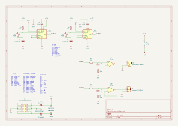
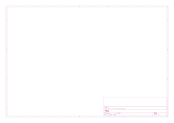

# relo

## Revisiones

- `rev-a`: en progreso, septiembre 2026.

## Esquemático y placa (rev-a)

Generados automáticamente por GitHub Actions a partir de `relo/relo-rev-a/relo-rev-a.kicad_sch` y `.kicad_pcb` en cada push que los modifica.

## Bill of materials (rev-a)

Generado a partir de `relo/relo-rev-a/relo-rev-a.kicad_sch`.

Esta revisión está en progreso: varios componentes todavía tienen el valor por defecto de la biblioteca (`R`, `C`, `C_Polarized`) en vez de un valor real, y ninguno tiene huella (footprint) asignada. Esta BOM es un punto de partida, no una lista final para comprar partes.

| Referencias | Cantidad | Valor | Huella | Descripción |
| --- | --- | --- | --- | --- |
| C3 | 1 | *(valor sin definir)* | *(sin huella asignada)* | Capacitor |
| C5, C6 | 2 | *(valor sin definir)* | *(sin huella asignada)* | Capacitor electrolítico |
| R3, R4, R5, R6 | 4 | *(valor sin definir)* | *(sin huella asignada)* | Resistencia |
| R7 | 1 | 10k | *(sin huella asignada)* | Resistencia |
| U1 | 1 | NA556 | *(sin huella asignada)* | Temporizador doble 556 |

9 componentes en total.
