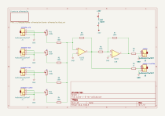
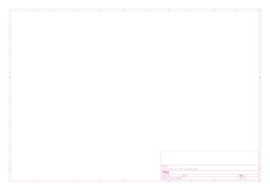

# suma

## Revisiones

- `v-0-rev-a`: única revisión presente en el repositorio.

## Esquemático y placa (v-0-rev-a)

Generados automáticamente por GitHub Actions a partir de `suma/suma-v-0-rev-a/suma-v-0-rev-a.kicad_sch` y `.kicad_pcb` en cada push que los modifica.

## Bill of materials (v-0-rev-a)

Generado a partir de `suma/suma-v-0-rev-a/suma-v-0-rev-a.kicad_sch`.

| Referencias | Cantidad | Valor | Huella | Descripción |
| --- | --- | --- | --- | --- |
| C1 | 1 | 220u | Capacitor_SMD:CP_Elec_6.3x7.7 | Capacitor electrolítico SMD |
| C2 | 1 | 10u | Capacitor_SMD:CP_Elec_4x5.4 | Capacitor electrolítico SMD |
| C3 | 1 | 100n | Capacitor_SMD:C_0805_2012Metric_Pad1.18x1.45mm_HandSolder | Capacitor cerámico SMD 0805 |
| D1, D2 | 2 | D_Schottky | easyeda2kicad:SOD-123FL_L2.8-W1.8-LS3.7-R-RD | Diodo Schottky SMD |
| J1, J2, J3, J4, J5, J6 | 6 | AudioJack2_SwitchT | *(sin huella asignada)* | Jack de audio 3.5mm |
| J7 | 1 | Conn_02x05_Odd_Even | BYOM_General:IDC-Header_2x05_P2.54mm_Vertical | Header de alimentación Eurorack (10 pines) |
| R1, R2, R3, R4, R5, R6, R7 | 7 | 100k | suma-v-0-rev-a:R0805 | Resistencia SMD 0805 |
| R8, R9 | 2 | 1k | suma-v-0-rev-a:R0805 | Resistencia SMD 0805 |
| RV1, RV2, RV3, RV4 | 4 | 100k | *(sin huella asignada)* | Potenciómetro |
| U1 | 1 | TL072 | suma-v-0-rev-a:SOIC-8_L4.9-W3.9-P1.27-LS6.0-BL | Amplificador operacional dual |
| U2 | 1 | L7805 | Package_TO_SOT_SMD:TO-252-2 | Regulador de voltaje lineal +5V |

27 componentes en total. Los ítems marcados *(sin huella asignada)* todavía no tienen footprint definido en el esquemático — hay que asignarlos antes de generar gerbers o comprar partes para esta revisión.
